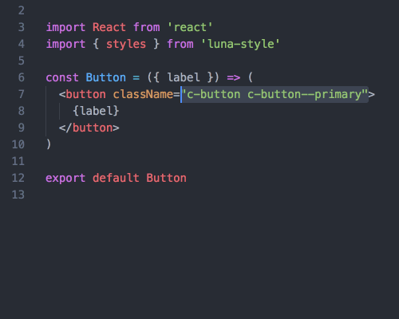

# PostCSS BEM To JavaScript [](https://circleci.com/gh/WebSeed/postcss-bem-to-js)

Translates CSS classes to a JavaScript file so that you can use typed definitions of styling classes in React / Vue.js etc. It includes support for BEM / ITCSS / BEMIT syntax.



## Why?

* Useful for [IntelliSense](https://code.visualstudio.com/docs/editor/intellisense) lookup of CSS classes in your JavaScript.
* Type safety. Ensures you only use CSS classes that are available (avoid typos / using deprecated classes etc.)
* Rolls BEM `modifiers` into `block` and `element` strings e.g. `my-block--large { ... }` becomes `MyBlock.$large === 'my-block my-block--large'`.

BEM example (`style.css`):

```css
.my-button { /* ... */ }
.my-button--primary { /* ... */ }
.my-button__link { /* ... */ }
.my-button__link--bold { /* ... */ }
.my-button__fancy-icon { /* ... */ }
```

Outputs `style.css.js` (and a `.css.json` variant too alongside unmodified input CSS):

```js
module.exports = {
  MyButton: {
    $primary: 'my-button my-button--primary',
    link: {
      $bold: 'my-button__link my-button__link--bold',
      toString: function () { return 'my-button__link' }
    },
    fancyIcon: 'my-button__fancy-icon',
    toString: function () { return 'my-button' }
  },
  Grid: {
    item: 'grid__item',
    toString: function () { return 'grid' }
  }
}
```

## Usage

```js
postcss([
  require('postcss-bem-to-js')
])
```

Example (`postcss.config.json`)

```json
{
  "postcss-bem-to-js": {
    "prefixMap": {
        "ln-o-": "o",
        "ln-c-": "c",
        "ln-u-": "u"
    },
    "replace": {
        "@": "_",
        "\\/": "of",
        "*": "_x"
    }
  }
}
```

### Config: replace

A map defining how to replace certain text/symbols in CSS with JavaScript variable naming friendly equivalents e.g.

```js
{
  replace: {
    '@': '_',
    '\\/': 'of',
    '*': '_x'
  }
}
```

With this `button@wide` becomes `button_wide`, `grid-1/2` becomes `item1of2`, and `spacing*2` becomes `spacing_x2`.

### Config: prefix map

You can also configure the plugin to accept a `prefixMap` to map namespaced (e.g. BEMIT) style naming to some other prefix e.g.

```js
{
  prefixMap: {
    'o-ns-': 'o',
    'c-ns-': 'c',
    'u-ns-': 'u'
  }
}
```

Converts `o-ns-foo` to `oFoo`
